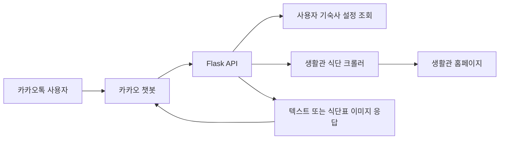

# 건국대학교 글로컬캠퍼스 생활관 식단 챗봇

건국대학교 글로컬캠퍼스 생활관의 식단 정보를 카카오톡에서 간편하게 확인할 수 있도록 만든 개인 프로젝트입니다.

해오름학사와 모시래학사의 식단을 수집해 오늘·내일 식단을 텍스트로 제공하고, 이번 주 식단은 이미지로 생성해 보여줍니다.

## 주요 기능

- 오늘·내일 식단 조회
- 해오름학사 / 모시래학사 선택 및 사용자별 설정 저장
- 이번 주 식단표 이미지 생성
- 주말·공휴일 식사 운영 여부 반영
- 반복 요청을 줄이기 위한 TTL 캐싱
- Render 배포 및 헬스체크 엔드포인트 제공

## 서비스 흐름



## 기술 스택

| 구분 | 기술 |
|---|---|
| Backend | Python 3.12, Flask 3.1, Gunicorn |
| Crawling | Requests, BeautifulSoup4 |
| Database | MongoDB Atlas |
| Image | Pillow |
| Chatbot | 카카오 챗봇 |
| Deployment | Render |

## 크롤링 방식

생활관 홈페이지는 세션 없이 식단 페이지에 직접 접근하면 `landing.do`로 이동합니다.

이를 처리하기 위해 `requests.Session()`을 사용해 다음 순서로 세션을 구성합니다.

```text
1. GET /landing.do
   └─ JSESSIONID 쿠키 획득

2. GET /main.do?dormType=...
   └─ 해오름학사 또는 모시래학사 컨텍스트 설정

3. GET /weekly_diet.do
   └─ 주간 식단 HTML 수집 및 파싱
```

식단 테이블의 헤더에서 실제 날짜를 추출하고, 요청한 날짜와 일치하는 열을 선택합니다. 현재 화면에 대상 날짜가 없으면 이전 주 또는 다음 주 식단을 다시 요청합니다.

수집한 식단 데이터는 10분 동안 메모리에 캐싱해 동일한 페이지를 반복해서 요청하지 않도록 구성했습니다.

## API

| Method | Endpoint | 설명 |
|---|---|---|
| POST | `/api/diet` | 오늘 또는 내일 식단 조회 |
| POST | `/api/weekly` | 이번 주 식단표 이미지 생성 |
| GET | `/api/weekly_image/<key>` | 생성된 식단표 이미지 반환 |
| POST | `/api/myinfo` | 현재 등록된 기숙사 조회 |
| POST | `/api/settings` | 기숙사 설정 조회 및 변경 |
| POST | `/api/register/haeoreum` | 해오름학사 등록 |
| POST | `/api/register/mosirae` | 모시래학사 등록 |
| GET | `/health` | 서버 상태 확인 |

## 사용자 데이터

사용자별 기숙사 설정은 MongoDB Atlas의 `kku_diet.users` 컬렉션에 저장됩니다.

```json
{
  "user_id": "카카오 사용자 ID",
  "dorm": "haeoreum | mosirae"
}
```

## 프로젝트 구조

```text
kku_diet/
├── app.py              # Flask 서버와 카카오 챗봇 API
├── crawler.py          # 식단 수집, 날짜 매칭, 캐싱
├── user_store.py       # MongoDB 사용자 설정 저장소
├── image_gen.py        # 주간 식단표 이미지 생성
├── fonts/              # 이미지 생성용 한글 폰트
├── build.sh            # Render 빌드 스크립트
├── Procfile            # Gunicorn 실행 설정
├── requirements.txt
└── README.md
```

## 로컬 실행

```bash
python -m venv .venv

# Windows
.venv\Scripts\activate

# macOS / Linux
source .venv/bin/activate

pip install -r requirements.txt
python app.py
```

기본 실행 주소는 `http://localhost:5000`입니다.

## 환경 변수

```env
MONGODB_URI=mongodb+srv://...
PORT=5000
CRAWLER_TIMEOUT_SEC=10
```

- `MONGODB_URI`: MongoDB Atlas 연결 문자열
- `PORT`: 서버 실행 포트
- `CRAWLER_TIMEOUT_SEC`: 생활관 홈페이지 요청 제한 시간

## 현재 한계와 개선 방향

- 메모리 캐시는 서버 재시작 시 초기화됩니다.
- 여러 서버 인스턴스를 사용할 경우 캐시가 공유되지 않습니다.
- 생활관 홈페이지의 DOM 구조가 변경되면 선택자 수정이 필요합니다.
- 운영 규모가 커질 경우 Redis 기반 공용 캐시와 자동화 테스트 확대가 필요합니다.

## 프로젝트에서 다룬 내용

- 세션과 쿠키가 필요한 웹사이트 데이터 수집
- HTML 테이블의 날짜와 실제 요청 날짜 매칭
- Flask 기반 카카오 챗봇 API 구성
- MongoDB를 이용한 사용자 설정 관리
- 이미지 생성 및 단기 캐싱
- 배포 환경에서 발생한 오류 추적과 개선
